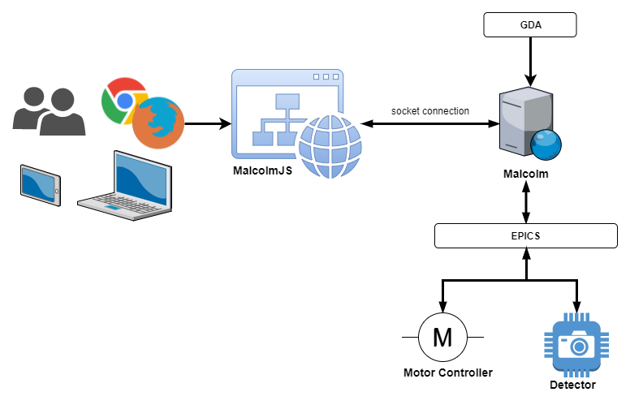
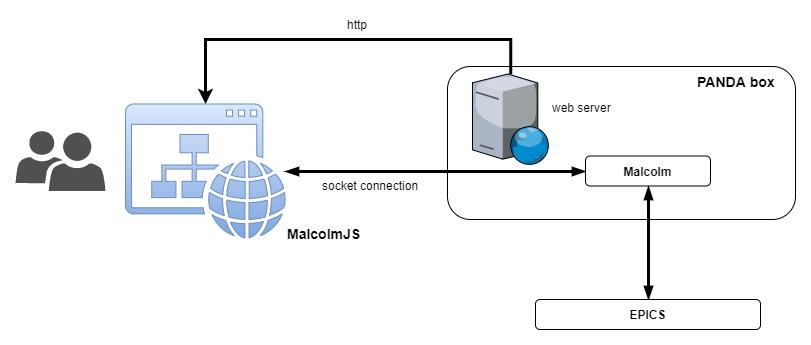
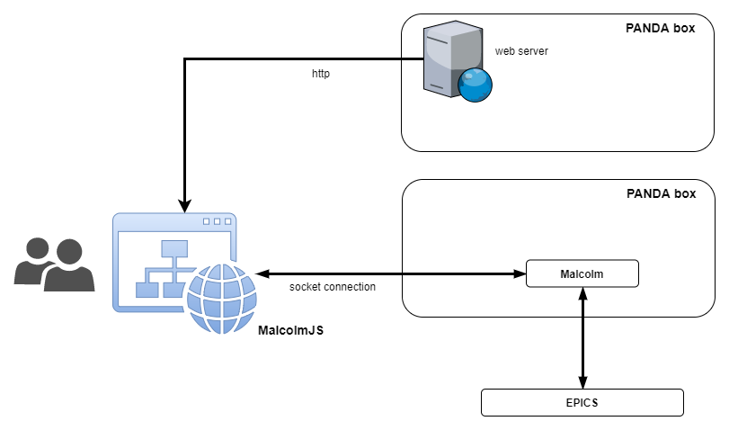

Architecture
============

Context
########

`Malcolm <http://pymalcolm.readthedocs.io/en/latest/>`_ provides a higher level abstraction over EPICS for monitoring and controlling devices (e.g. motor controllers or area detectors). **MalcolmJS** is a user interface for Malcolm that allows blocks to be wired together and more complex behaviours to be programmed into the hardware (e.g. custom scan patterns).

    MalcolmJS context within its wider environment

The overall use case for MalcolmJS is that engineers will be using it to configure PANDA boxes from a laptop, this will involve wiring blocks together, tweaking inputs and monitoring outputs. This may involve working with physical hardware so as much information needs to be available on the screen as possible whilst minimising scrolling (this helps to reduce context switching).

The other minor use case is to allow engineers to view block attributes on their phone, this will allow them to monitor outputs and tweak inputs without having to go back to their laptop.

Containers
###########

TODO: container diagram

Description of container level

Components
############

TODO: diagram of components

Description of components

Deployment View
###################

There are two main deployment scenarios, the primary deployment scenario is where MalcolmJS is packaged up with Malcolm and served from a web server inside Malcolm on the same PANDA box.

    Serving MalcolmJS from the same server as Malcolm

The second scenario is where MalcolmJS is served from a different web server inside the Diamond network (it may or may not be from a PANDA box in this case) but connecting to the Malcolm socket on a different PANDA box.

    Connecting to Malcolm on a different server

UI Mockups
#################

Technologies
#############

The technology stack selection has been based on the principles of:

- Making use of **Open Source Software**
- Selecting modern, well supported frameworks to ensure long term sustainability (within the bounds of the previous principle)
- Fitting in with Diamond processes where there are clearly defined technology choices for consistency

By Component
^^^^^^^^^^^^^
- **MalcolmJS redux components**
    A set of components for handling socket communication with Malcolm that intercepts messages intended for Malcolm and sends them, as well as injecting responses back into the Redux one-way data flow. 
- **MalcolmJS attribute components** 
    A set of presentation only react components that could be distributed as an npm package for other people to develop MalcolmJS dashboards with.
- **Remaining MalcolmJS presentation components** 
    The other container components needed to layout the MalcolmJS site and wire the presentational compoenents up to the MalcolmJS redux components.

Tools
^^^^^^^^

- Create React App for the initial site template
- Jest unit testing and coverage
- Cypress end-to-end testing
- React Storybook
- React Storybook Info addon
- ESLint with the AirBnB rule set
- Prettier code styling
- Husky for pre-commit hooks
- Travis for continuous integration
- Github releases for uploading build artifacts back to Github
- Waffle.io for Agile tracking
- Codecov for tracking code coverage
- Github for version control and issue management
- Sphinx for document building

Languages
^^^^^^^^^^^

- Javascript
- reStructuredText
- bash
- yaml

Frameworks
^^^^^^^^^^^^

- React
- Redux
- React-Router
- Redux-thunk
- Socket.io
- Material UI

Quality
###############

Coding Standards
^^^^^^^^^^^^^^^^^^^

Static code analysis is done by running ESLint against the code with the `AirBnB rule set <http://airbnb.io/javascript/>`_. Code styling is done with `Prettier <https://prettier.io/>`_ to avoid debates on code styling. These are both enforced as pre-commit hooks with the ``--fix`` option turned on so as much as possible is automatically fixed. This ensures the static code analysis violations remain at zero unless explicitly ignored.

Unit testing is all done with Jest which provides code coverage information using the ``--coverage`` flag, this generates an LCOV report with all the coverage information. The coverage information is tracked on CodeCov, where during this phase of development, all the information is on the `version 1 branch <https://codecov.io/gh/dls-controls/malcolmjs/branch/version1>`_.

    
    Unit test coverage for the last 6 months on branch ``version1``

All code including documentation should be peer-reviewed, as such all work must be done on a branch and a pull request created in order to review the code before merging into the main branch (during this phase of the project it is ``version1``).

Branches should use the naming convention ``feature/{descriptive name}-#{issue number}``. By adding the issue number to the end it allows the waffle.io integrations to automatically move cards on the agile boards when particular activities are in progress/completed.

When creating a pull request you should also add the comment
::

    connect to #{issue number}

to the description to link the pull request to the issue.

Pull requests are gated so the automated build in Travis needs to succeed and the reviewer should also take note of the impact on code coverage. The aim is to maintain a high level of coverage (e.g. over 90% is good) but whilst being pragmatic, it is not an exercise in getting a high number but rather making sure the new code is sufficiently tested for maintainability.

Security
^^^^^^^^^

There are no current security restrictions on MalcolmJS as it has to be able to communicate with a Malcolm enabled devide which are all inside the Diamond internal network and so MalcolmJS will also have to be accessed from inside the network. Once inside the network anyone is allowed the configure the Malcolm settings.

Testing
^^^^^^^^^

As much effort as possible should be made to automate unit, integration and system testing. MalcolmJS will use as much unit testing as possible, as well as running end-to-end tests against a test server that mimics the socket responses. This should mean very few system tests are needed as we can expand the socket responses of the test server to cover these cases. Where system tests are needed then they will need to be done manually as they will need to be run against an actual PANDA box but could still be based off scripted tests (e.g. using cypress).

Given we are developing a website, usability testing will also be important so we should plan to get some engineers to do some testing and gather their feedback.

One of the big issues with versions prior to version 1 was performance and the time taken to re-render updates. We should also put additional effort into performance testing to make sure the page is at least usable (i.e. it doesn't need to be lightning fast but shouldn't freeze up, it should at least indicate to the user it is still responding but could be waiting for a response).

Attitude Towards Bugs and Technical Debt
^^^^^^^^^^^^^^^^^^^^^^^^^^^^^^^^^^^^^^^^^

Bugs severely affect the maintainability of the system, as far as is practical we should seek to have a zero bug system - this means that when a bug is identified then it gets prioritised to the top of the backlog and dealt with as soon as possible.

This approach should ensure that the number of bugs doesn't become un-manageable and then ignored because they seem unsolvable.

The same approach should be employed with technical debt, we should seek to minimise technical debt so the system is more maintainable. This should allow us to develop faster because we aren't weaving new features into an existing fragile system. The one caveat with this is that a level of pragmatism needs to be taken depending on the timescales and progress needed for the project, but remembering that every un-addressed issue will slow the project down at some point in the future.