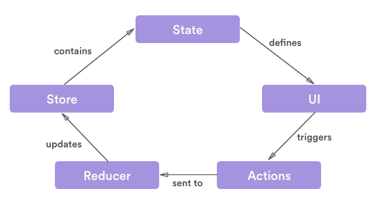
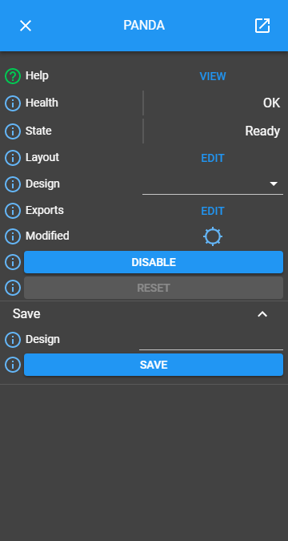

Code Structure
==============

This section seeks to give a description of the code structure so new developers can get aquainted with how the main components of the user interface link to the folders in the code base.

The diagram below shows a general view of the MalcolmJS interface:

    An example of the MalcolmJS interface

The main components of this page are the **block details** on the left and right which are held in a **drawer container**, the **nav bar** at the top of the page and the **layout view** in the middle pane. We will explore this components in more detail in the following sections.

How to link UI components to backend actions/reducers
#######################################################

In order to understand how the state and business logic links to the UI components we first need to revisit how data flows in a React-Redux system.

The main data contruct of a Redux system is the Store that contains a state, the state defines the UI and what is visible. A user then interacts with the UI and triggers actions which are sent to reducers, these reducers then update the state in the store.

    How data flows round a react-redux system

In order to find out what updates to the store happen because of interactions with the UI it is important to follow this one-way data flow round the loop. From a component you will be able to find the actions that it fires (typically within the ``mapDispatchToProps`` method), you'll then look for the reducer that handles the type in that action, from that reducer you can see the changes that are made to the state.

Each action should be of the form:

.. code-block:: javascript

    const actionType = 'A_CONSTANT_STRING_FOR_THE_ACTION';

    const action = {
        type: actionType,
        payload: {
            someContents: {}
        }
    };

    const reducer = (state, action) => {
        switch (action.type) {
            case actionType:
                // do something with the actionType action
        }
    };

It is important that the action does not contain a direct string for the type, instead it should be referenced from a constant. This then enables IDEs to search for all usages and it will immediately highlight the reducers that the action is handled in.

Another way of linking the UI components to the actions and reducers is by the naming convention, general a layout component will have a matching set of actions and a reducer; for example, the ``layout`` component has actions in ``layout.actions.js`` and a reducer in ``layout.reducer.js``.

Drawer Container
#################

The main container component for MalcolmJS is the drawer container, this component holds the drawers on either side and the main panel in the middle behind the drawers.

The drawer container itself does not have much functionality, it simply holds other components.

Block Details
#############

The block details component is again another container component but this time specifically focused on an individual block. The block details component pulls together all the attributes on a block and works out if they should be displayed in groups, as methods, or if they are a top attribute.

    The block details panel in the main UI

Attribute Details
^^^^^^^^^^^^^^^^^

Each attribute is displayed in an attribute details component, this component is responsible for working out which widget to use for the given attribute.

The main structure of the attribute details component is the alarm status, the label and then the widget for that attribute.

    The attribute details inside the block details

Methods
^^^^^^^^^^^^^^^^^

Methods are special attributes that get displayed with their own component because of the extra complexity around handling their state for the inputs as well as tracking the outputs returned by Malcolm.

The method component generally consists of a set of inputs (again selected using the same mechanism as in the attribute details) and then a run button. If the method returns outputs then they will be shown below the run button when they are received.

    A method inside the block details

NavBar
#######

The main method of navigating around in MalcolmJS is through the NavBar, this component along the top of the page is responsible for displaying the tree of blocks/attributes/info that is currently being viewed; each of those nodes of the tree are represented by a NavControl.

The left most drop down is special because it contains the top level list of blocks from the ``.blocks`` output from Malcolm.

    An example of the navbar

NavControl
^^^^^^^^^^^^^^^

Each NavControl represents a node of the navigation tree that has been previously visited, it provides a user with a mechanism of jumping directly back to that node or alternatively selecting a new child of that node in the menu to the right of the nav control.

    A navcontrol inside a navbar

    The menu of children to navigate to

Layout
########

The layout folder in the code base contains everything related to displaying the layout of Malcolm blocks. In the example below we can see various blocks that each have ports and those ports have links joining them together.

The blocks, ports and links all have folders with corresponding code.

    An example of the layout component

Malcolm
##########

Generally all of the code in the Malcolm folder defines the business logic for the MalcolmJS system, the idea being to keep as much of the Malcolm related code together so it can potentially be distributed as a separate library.

The top level of this folder contains the top level MalcolmJS redux types, the socket handling and various utility functions.

actions
^^^^^^^^
The actions folder contains all the actions for performing malcolm related Redux operations, e.g. sending a message back to Malcolm, calling a Malcolm method or changing the layout of the blocks.

reducers
^^^^^^^^

The reducers folder has all the reducers that mutate the state related to malcolm operations.

middleware
^^^^^^^^^^

The middleware folder has all the code related to sending messages to the Malcolm websocket.

malcolmHandlers
^^^^^^^^^^^^^^^^

The malcolm handlers relate to the malcolm socket handler in the root malcolm folder and provide the logic for processing attributes, etc. 

MalcolmWidgets
###############

The folder contains all the UI components for displaying attributes, however these components are more generally used throughout the UI to show inputs for methods as well as controls inside table cells.

