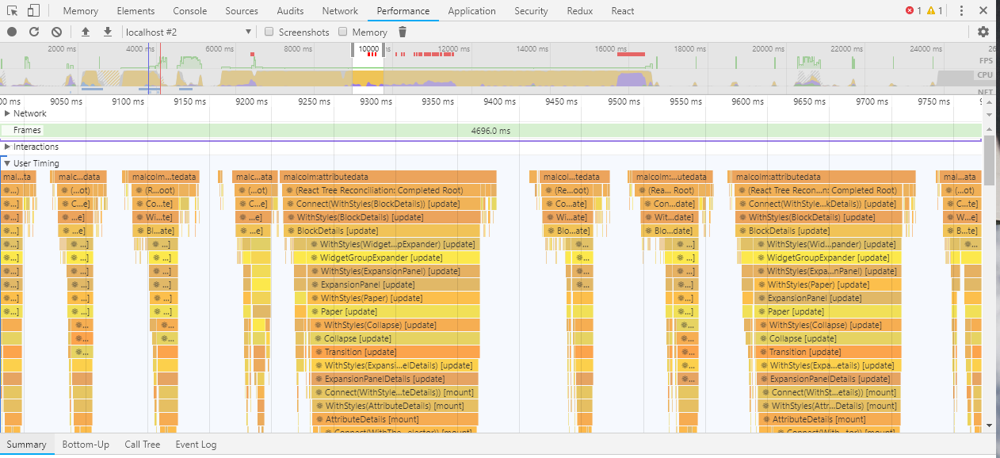

Performance
===========

React Performance Tools
-----------------------

Profiling of MalcolmJS is mainly done using the performance tools in the browser, currently this is only supported in Chrome, Edge and IE as React uses the User Timing API but they expect more browsers to follow.

React has a good page describing how to optimise performance at https://reactjs.org/docs/optimizing-performance.html#profiling-components-with-the-chrome-performance-tab

The important point to note is that all of the React events are under the ``User Timing`` section. We have also added middleware (outlined here https://medium.com/@cvitullo/performance-profiling-a-redux-app-c85e67bf84ae) to allow us to track the time for redux actions.

An example of the profiling output is shown below:

    An example of the profiling output when loading MalcolmJS

Why-did-you-update Middleware
-----------------------------

In order to identify unnecessary renders we have included the ``why-did-you-update`` npm package, this is a piece of redux middleware that identifies when the props of a component haven't actually changed.

It adds a significant performance cost and so the code to include it is commented out in ``index.js`` but can be uncommented on an adhoc basis to run a check on why renders are happening.
