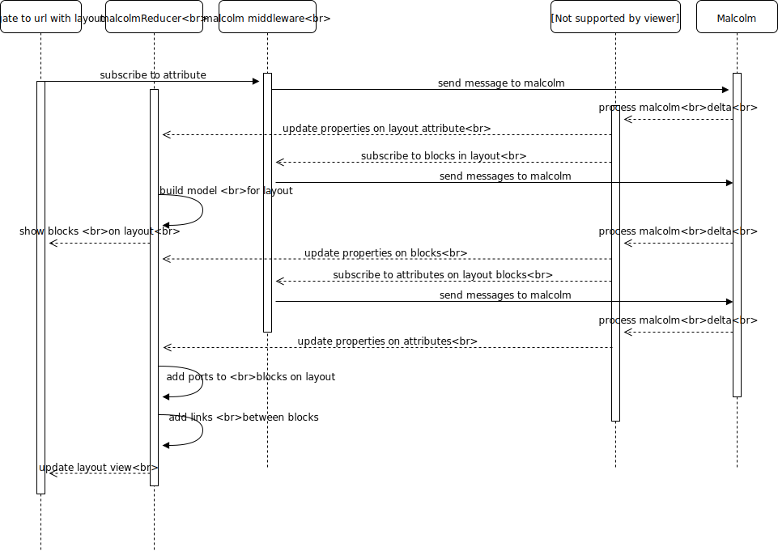

Sequence Diagrams
==================

Connecting to the websocket
############################

    Connecting to the websocket

Getting Block Details
#####################

    How the block information is gathered

Loading the layout
#####################

    Building the layout view

Running a method
#####################

    Running a method