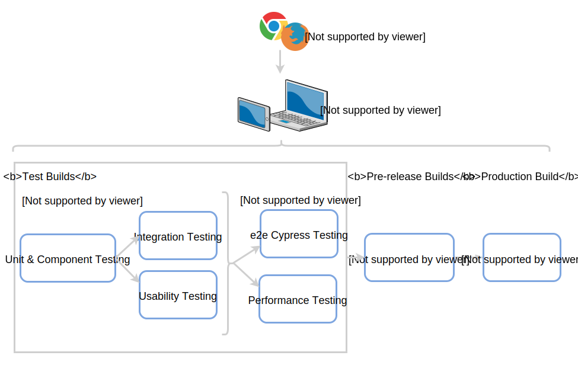
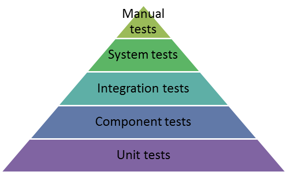

Testing Strategy
=====================================

Scope
^^^^^^

*In-Scope*:

* Functional and non-functional user story testing
* Unit, integration, and system testing for the developed code 
* UI testing for usability and performance scenarios
* User Acceptance testing against a PandA simulator
* Deployment testing against a PandA
* Compatibility testing on the below-listed browsers and devices
   - Firefox (Must have)
   - Chrome, (Should have)

*Out-of-Scope*:

* Security testing
* Penetration testing
* Browsers that are not included in the in-scope list. 
* Touch interactions (at least at this point of the project)

Strategy
^^^^^^^^

The test strategy for each sprint is split into development testing, system testing, and user acceptance testing; they are carried out by various members of the team in different project phases. 

    Progression through the testing stages

Builds will progress through the various stages when they succeed at all previous levels. For example, builds passing all unit, integration and system tests will be deployed to a PandA for user acceptance tests, etc.

Gnerally the number of tests and time for execution should follow the pyramid of testings shown in the diagram below and explained in this blob post by Uncle Bob https://codingjourneyman.com/tag/uncle-bob/page/2/

    Number of tests for each stage of testing

Development Testing
^^^^^^^^^^^^^^^^^^^
Development testing is managed and maintained by the developers. A Test Driven Development (TDD) approach should be practised by developers for every story developed. Developers play a key role in the testing process in addition to the tester; unit and integration testing are the sole responsibility of developers and an integral part of the development activity.  

- Automated Unit and Integration tests will be created and monitored around all the features where business logic materialises. 
- Formal and informal peer reviews are performed throughout the project to ensure coding standards and good practice guidelines are followed, primarily through pull requests.

System Testing
^^^^^^^^^^^^^^
Without a dedicated tester we are aiming to create a set of automated regression tests that run using the production build. These automated tests are written using the Cypress test framework.

One advantage of automating the end-to-end (e2e) tests is that they can be run as part of every build rather than waiting for a deployment of the system.

Part of the system testing will also be **unscripted testing**, whereby during development or whilst looking over the system general; if we spot a bug then it should be reported.

**Defect Management**

If the story is still open then the developer will be informed of the defect and will be expected to fix it before the story is closed. If the bug is found after a story is closed then a new bug should be recorded in the backlog and prioritised accordingly.

User Acceptance Testing
^^^^^^^^^^^^^^^^^^^^^^^
In Sprint review meetings, the project team will demonstrate the user story implementation in the Test environment. Business users will be talked through the acceptance criteria for each committed story in the sprint using the latest release build. Post-review meeting, the business users may perform their user acceptance testing by downloading and running MalcolmJS to evaluate the functionality and usability of the application. Any issue or suggestions identified in the user evaluation period shall be communicated to the development team for further action; most likely story creation and prioritisation.

Deployment Testing
^^^^^^^^^^^^^^^^^^

At periodic intervals we will deploy to a real PandA to evaluate the performance of MalcolmJS. Before MalcolmJS is released to users, the project team will carry out non-destructive sanity testing to ensure build correctness.