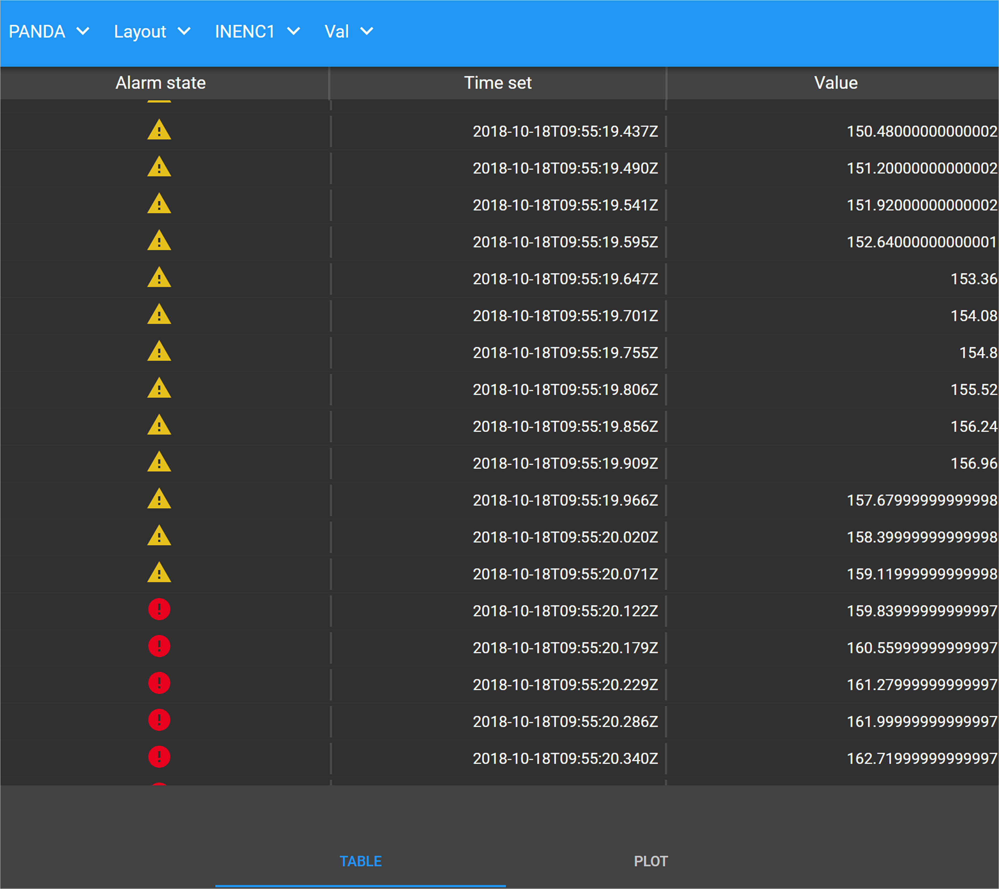

Monitoring Attribute Values
===========================

The user interface provides a near-realtime graphical representation of values
associated with an `attribute` against time.  Attribute values can be
represented graphically as a *chart* or numerically as a *table*.

Working With Charts
-------------------

Plotting data in a chart begins at the time the Attribute is selected (via the
'information' icon associated with it in its `block`).  The data displayed is a
'for information only' representation of the Attribute's characteristics for the
duration over which the plot remains open.

The User Interface renders every attribute as a chart.  In doing so it handles
the different Attribute formats available in different ways.  In all cases the X
axis represents time.

.. list-table::
    :widths: 30, 70
    :align: center
    :header-rows: 1

    * - Attribute Format
      - Plot Type
    * - Numerical data
      - Continuously recorded data is displayed as a traditional scatter plot
        with Attribute values on the Y axis.
    * - Text data
      - Displayed in a similar way to discrete numberical data but in this case
        the Y axis representing each unique text string specified.
    * - Boolean data
      - Representing on/off states within Attribute settings.  The Y-axis
        represents the on or off setting.

Interactive Chart Functionality
~~~~~~~~~~~~~~~~~~~~~~~~~~~~~~~

Once displayed you have a number of tools at your disposal to support
interaction with the chart.  Hovering the mouse pointer over the chart displays
the chart menu bar:

      Chart options bar

The following options are available:

.. list-table::
    :widths: 30, 70
    :align: center
    :header-rows: 1

    * - Option
      - Description
    * - Download Plot as PNG
      - Provides the ability to download a snapshot of the chart for use outside
        the user interface.
    * - Edit in Chart Studio
      - Generates a snapshot of the data behind the plot and exports it to the
        online Chart Studio tool.
    * - Zoom
      - Allows you to select a rectangular bounding box around a feature of
        interest and zoom in on it.  The level of zoom dynamically adjusts
        according to the size of the bounding box (smaller box = higher zoom)
        with X and Y axes dynamically scaling to reflect the granularity of the
        resulting plot.  Note that while zoomed updates to the selected area
        pause, instead presenting a snapshot at the time of zoom. 
    * - Pan
      - Provides the ability to pan the chart through horizontal and vertical
        axes.  Note that unlike **Zoom** options panning does not pause
        automatic updates, thus when panning back through time the plot may
        appear blank.
    * - Zoom in/out
      - similar to the manual **Zoom** option described above but automatically
        focussed on most recent data.  As noted above zooming pauses automatic
        chart updates, presenting the area of zoom only.
    * - Autoscale
      - Automatically scales the plot to include all data available since the
        Attribute was originally selected.
    * - Home (Reset Axes)
      - Resets the chart back to its default scale after **Zoom** and **Pan**
        actions, restarting automatic updates of the chart as it does so.
    * - Toggle Spike Lines
      - Click this option once to overlay vertical and horizontal guide lines
        when hovering over a data value.  Click a second time to disable
        overlay.
    * - Show closest data to hover
      - Displays the Attribute value for the closest data point to the current
        cursor location.
    * - Compare data on hover
      - Displays *all* Attribute values at the time point represented by the
        cursor position (see notes on
        `Data Retrieval and Chart Update Frequency` below).

Enhanced Chart Interactivity
~~~~~~~~~~~~~~~~~~~~~~~~~~~~

While the chart interface provides basic interactive exploration capabilities it
is largely limited to panning and zooming.  Further interactive capabilities are
directly available via the '**Edit in Chart Studio**' option in the chart menu
bar.  Selecting this option automatically exports the data associated with the
current on-screen chart and opens it in the online `Chart Studio
<https://plot.ly/online-chart-maker/>`_ tool.  Further information on the use of
Chart Studio is available in its own `online documentation
<https://help.plot.ly/>`_.

.. NOTE::

    The external charting tool provided through the '**Edit in Chart Studio**'
    option is provided by a third party organisation.  Functionality and support
    for this tool is not the responsibility of the MalcolmJS team.

Exporting a Chart For External Presentation
~~~~~~~~~~~~~~~~~~~~~~~~~~~~~~~~~~~~~~~~~~~

A snapshot of a chart can be taken at any time via the '**Download Plot as
PNG**' option in the chart menu bar.  The snapshot, representing the content
displayed on screen at the time of selection, is automatically saved to the
'Downloads' folder of your local storage device.

Data Retrieval and Chart Update Frequency
~~~~~~~~~~~~~~~~~~~~~~~~~~~~~~~~~~~~~~~~~

#. Data is supplied to the chart interface at a frequency of up to 20Hz.

#. On screen graphics update at a pre-defined temporal frequency of 1 second and
   cannot therefore be regarded as a true realtime display.  Each 1 second
   update plots *all* data supplied at 20Hz frequency during preceeding second.

#. On zooming into a plot the plot update process is paused to enable inspection
   of the area of interest.  Automatic updates resume on returning to the
   default view state.

Working with Numerical Tables
-----------------------------

A table present Attribute values in numerical form.  Each row in the table
represents a change in value, with each row presenting:

  * The time at which the Attribute value changed.
  * The value of the Attribute after the change.
  * The status of the Attribute against parameterised alarm states.

For example:

      Attribute values presented in tabular formal

The data displayed is a 'for information only' representation of the Attribute's
characteristics for the duration over which the table remains open.

Data Retrieval and Table Update Frequency
~~~~~~~~~~~~~~~~~~~~~~~~~~~~~~~~~~~~~~~~~

#. Data is supplied to the table at a frequency of up to 20Hz.

#. On screen updates are set to a pre-defined temporal frequency of 1 second.

#. Each 1 second update includes *all* data supplied at 20Hz frequency during
   the preceeding second.

#. Newest data is presented at the *bottom* of the table.

