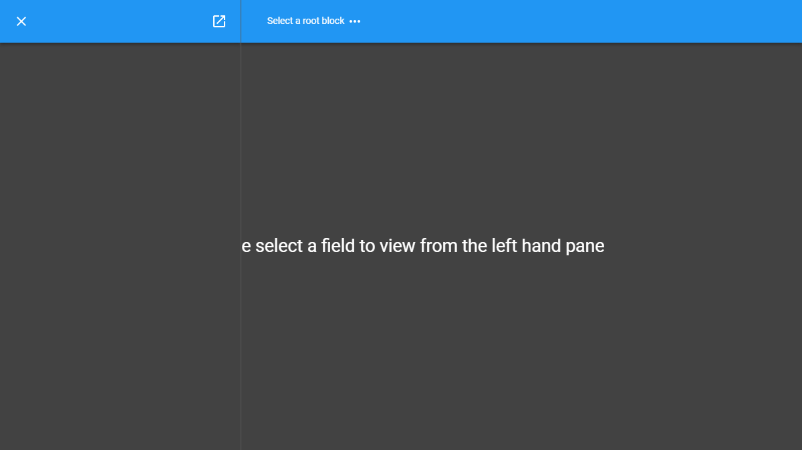

Quick Start
=============

This quick start walkthrough aims to show you how a simple workflow might be carried out using MalcolmJS, it will be brief but the user interface should feel intuitive enough that this guide will allow you to get started quickly on your own instance.

    The intial screen

.. figure:: screenshots/block-list.png
    :align: center

    Selecting a top level block

.. figure:: screenshots/PANDA-block-details.png
    :align: center

    The details for a PANDA block

    Click on the ``View`` button in the layout attribute to see the layout in the middle panel

.. figure:: screenshots/PANDA-layout.png
    :align: center

    The layout for the PANDA block