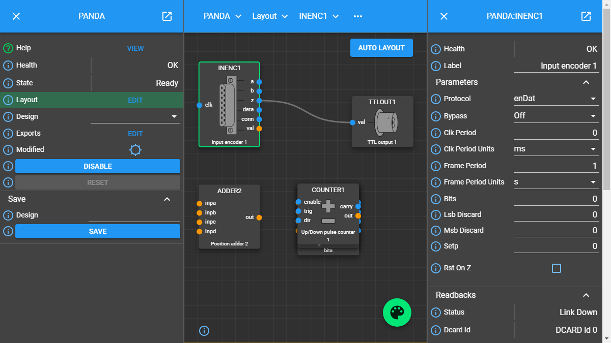
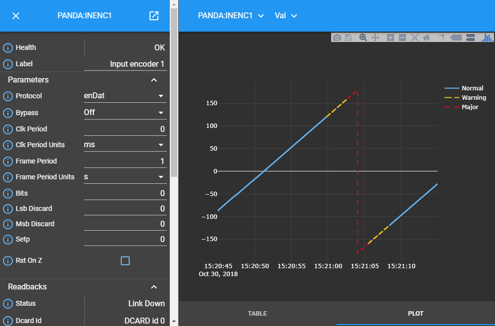

.. _user_interface_overview_:

User Interface Overview
=======================

The user interface provides a fully interactive environment for designing, configuring and managing components and the links between them that together define the underlying control system.

User Interface Components
-------------------------

The user interface consists of four core components.  The content of each compoent changes dynamically to support the activity you are undertaking:

.. figure:: images/ui_schematic.png
    :align: center

    User interface overview

Looking at each component in more detail:

.. list-table::
    :widths: 20, 80
    :align: center
    :header-rows: 1

    * - Component
      - Description
    * - Navigation Bar
      - The *'navigation bar'* at the top of the screen provides the ability to move through the currently open Design, selecting design elements at increasingly deep levels of implementation beginning at your selected `root_block_`.  In doing so it provides a breadcrumb-like map of where you currently are within the Design.
    * - Left-hand Panel
      - The *'left-hand panel'* provides general information about the `parent_block_` currently forming the central focus of interest within the user interface.  
    * - Central Panel
      - The *'central panel'* displays information about an Attribute selected from the Parent Block presented in the 'left-hand panel'.  If **Layout** is selected from a `parent_block_` then the `Layout View <layout_view_>` is displayed.  In `Attribute View <attribute_view_>` a `plot <monitoring_attribute_values_>` or `table <monitoring_attribute_values_>` of Attribute value data against time is displayed. 
    * - Right-hand Panel
      - The *'right-hand panel'* provides detailed information about the Block, Attribute or Link currently in focus.  For example, if the 'left-hand panel' represents a `block_` the 'right-hand panel' reflects an `attribute_` within that Block or a `link_` associated with it.  If the 'left-hand panel'represents the `parent_block_` then the 'right-hand panel' may contain details of an Attribute associated with that block or a `child_block_` contained in the Parent Block's Design.

.. _principle_ui_views_:

Principle User Interface views
------------------------------

To support design, configuration and management activies the user interface provides two principle views into the underlying control system:

.. list-table::
    :widths: 20, 80
    :align: center
    :header-rows: 1

    * - View
      - Content
    * - `Layout View <layout_view_>`
      - Provides an interactive environment for designing and configuring your control system through `block_`, `attribute_` and `link_` specification.  The resulting `flowgraph_` provides a visual representation of the formal `design_`.
    * - `Attribute View <attribute_view_>`
      - Provides details of a single Attribute, including the ability to view graphical representation of the Attribute's value within the control system over time.

.. TIP::
    Remember that the location of information, and its nature, will depend on the context in which you are viewing it.  In summary:

      * A Block is *always* displayed in the left-hand panel.  This may represent a Parent Block or a Child Block.
      * Attribute meta-data is always displayed in the right-hand panel.
      * Link information is always displayed in the right-hand panel.

.. _layout_view_:

The Layout View
---------------

Layout View is used to create, modify and manage the overall Design of your control system.  

Layout View is accessed via the **'View'** or **'Edit'** button associated with the *'Layout'* Attribute on a `parent_block_`.   

Once the `layout_` is displayed individual `blocks <block_>` within it can moved around the screen by clicking and dragging them to your desired location.  Any `links <link_>` will be dynamically re-routed to accommodate the new location.  Note there is also the ability to automatically optimise the Layout via the **'Auto Layout'** button within the 'central panel'.

A typical example of the view you may expect to see is shown below.

      Example layout

In this example we see:

    * Summary information about the 'PANDA' system displayed in the 'left-hand panel'.
    * The Design of the 'PANDA' presented in the central `layout_` panel.  Note the 'CLOCKS' `block_` is highlighted.
    * Detailed information about the 'CLOCKS' Block in the 'right-hand' panel, including all of its pre-defined `attributes <attribute_>`.
    * The 'navigation bar' denoting that we are viewing the 'CLOCKS' Block via the layout of the 'PANDA' System.

.. _attribute_view_:

The Attribute View
------------------

The user interface automatically transitions to Attribute View when an Attribute is selected from either the 'left-hand panel' or 'right-hand panel'.  

    * If the Attribute is selected from the 'left-hand panel' more detailed information about that Attribute is displayed in the 'right-hand panel'.
    * If the Attribute is selected from the 'right-hand panel' the `Block` represented in the 'right-hand panel' is transferred to the 'left-hand panel' as the new focus of interest, with more detailed information about the selected Attribute now presented on the right.

In both cases the 'central panel' presents a view of the Attribute's value against time.  This may represent a constantly changing value, for example a calculated data value updated every 2ms, or a periodically changing boolean on/off status indicator that only changes every 10h.  Two representations of the Attribute value are available and can be selected by choosing the appropriate option at the bottom of the 'central panel' thus:

    * Plot - presents the Attribute Value as a line chart, displaying value against time.  This graphical view is interactive and as a user you have the ability to undertake basic activities within the chart including panning, zooming and exporting for offline use.  See `monitoring_attribute_values_` for further information.
    * Table - presents the Attribute Value as a series of rows in a table.  Each row represents the value at a different time point.
    
For example, viewing the plot associated with the 'Val' Attribute of the 'PANDA Input Encoder' Block:

      Example plot showing continuously recorded data

.. NOTE::
  Since we are now in 'Attribute View' the left-hand panel contains details of the 'Input Encoder 1' Block not the 'PANDA' Parent Block.

Panel Popping
-------------

Under normal use the 'left-hand panel' contains summary information about the current `block_` in focus and the 'right-hand panel' detailed information relating to an `attribute_` or `method_` associated with that Block.  In complex systems it may be desireable to display information about a number of connected Blocks to track how each updates as data moves through the system they represent.  This can be achieved by *'popping'* the Block Information Panel via the icon in the top left-hand corner of the panel.  This causes the Block Information Panel to open in its own independent window.  Multiple panels can be opened in the same way.  

Connectivity to the underlying system is maintained meaning each independent window is updated in response to activity within the control system.  Similarly, manual updates to any Attribute within an independent Information Panel is reflected back to the control system in the same way as occurs when the Information Panel is integrated with the main user interface.  For example:

.. figure:: screenshots/window_popping_output.svg
    :align: center

    Example of multiple Block Information Panels popped into an independent display

In this image, which spans two monitor screens, we see three Child Blocks ('CLOCKS', 'COUNTER1' and 'BITS') associated with the 'PANDA' Parent Block *popped* into individual windows and displayed alongside the overall 'PANDA' Layout.

