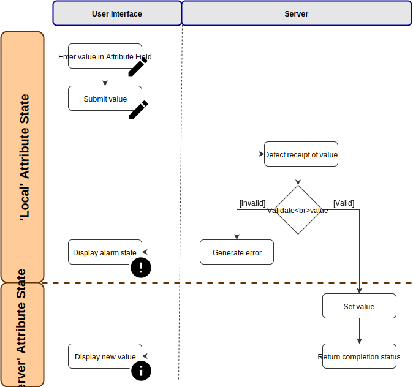

Working With a Design
=====================

A `design` forms the heart of your system implementation.  It provides an
interactive graphical representation of your system, helping you build and
manage:

* `Blocks <block>` representing hardware components, logic gates, etc.

* The `connectivity <link>` between blocks, in terms of input (sink) ports and
  output (source) ports.

* The `attributes <attribute>` associated with blocks and links.

* The `methods <method>` available to influence behaviour within blocks.

A Design is created in the user interface `Layout View`.

Adding a Block to a Design
-----------------------------

A `block` is added to a `design` by dragging and dropping it from the 'Block
Palette' into the `Layout View` as follows:

    #. Select the **'Palette'** icon at the bottom of the Layout Panel.  The
       Block Palette opens containing the set of blocks currently available
       to you.

    #. Identify the Block you wish to add.  By hovering over it the mouse
       pointer changes from an arrow to a hand.

    #. Click the left mouse button to select the Block and while holding down
       the mouse button drag the Block into the Layout Panel.

    #. When you reach your desired location for the Block within the Layout
       Panel release the mouse button.

The Block Palette icon is replaced by a full representation of the selected
Block, showing:

    * The Block name (shown relative to its `Parent Block`).
    * An optional, configurable descriptive label (initially containing default
      text).
    * `Source Ports <Source Port>` responsible for transmitting output from the
      Block, including their type.
    * `Sink Ports <Sink Port>` responsible for receiving input to the Block,
      including their type.

After adding a Block to the Layout Panel it can be selected by hovering over it
and clicking the left mouse button.  Upon selection the
`Block Information Panel` presenting each `attribute` and `method` available
to that Block is displayed in the right-hand panel of the web interface.

.. NOTE::

    On intially adding a new Block to your Design it is configured according to
    its pre-defined default settings retrieved from the underlying Design
    Specification of that Block.

Removing a Block from a Design
---------------------------------

If a `block` has been added to a `design` erroneously, or is no longer required
within the current Design it can be removed in one of two ways:

#. *By dragging it to the Bin:*

    #. Select the Block to be removed by hovering over it and clicking the left mouse button.  Upon selection a **'Bin'** icon is displayed at the bottom of the Layout Panel.
    #. While holding down the left mouse button drag the Block over the **'Bin'** icon.  The icon is highlighted.
    #. Release the left mouse button.

#. *Hitting the Delete or Backspace Key:*

    #. Select the Block to be removed by hovering over it and clicking the left mouse button.  The selected Block is highlighted.
    #. Hit the *Delete* key or *backspace* key on your keyboard.

.. NOTE::

    Upon removing a Block from your Design all `Source Port` and `Sink Port`
    links associated with it are automatically removed.

Working with the Block Palette
------------------------------

The Block Palette contains a list of each `block` available to a `design` based
on pre-defined constraints imposed by the underlying hardware infrastructure
associated with the system.

When a Block is selected from the Block Palette for inclusion in a Design it is
removed from the Block Palette to ensure it is not included more than once.  If
all Blocks of a particular type have been added to a Design it is not possible
to add any more as the underlying hardware implementation will not be able to
represent them.

If a Block is `removed <Removing a Block from a Design>` from a Design it is
immediately available again for selection in the Block Palette.

Specifying Block Attributes
---------------------------

The behaviour of a `block` is defined via its `attributes <attribute>`.
Attributes are pre-defined based on the function of the Block and may include
default values providing a starting point for later implementation-time
customisation.  A full list of the attributes associated with each Block
available from the Block Palette can be found in the documentation associated
with that Block.

Types of Attributes
~~~~~~~~~~~~~~~~~~~

Four types of `attribute` are available, and a `block` may support zero or more
of these depending on its purpose.  These are summarised as follows:

.. list-table::
    :widths: 30, 70
    :align: center
    :header-rows: 1

    * - Type
      - Description

    * - `Input Attribute`

      - An Attribute identifying the source of data that will be received into a
        `block` via a `Sink Port` with the same name.

    * - `Output Attribute`

      - An Attribute identifying the value (or stream of values) that will be
        transmitted out of a `block` via a `Source Port` with the same name.

    * - `Parameter Attribute`

      - An Attribute that can be set by a user while configuring a Block,
        ultimately influencing the behavior of that Block.

    * - `Readback Attribute`

      - An Attribute whose value is set automatically by a process within the
        execution environment.  Readback attributes cannot be set manually via
        the user interface.

Attributes whose value can be set at design-time are denoted by a highlight
below the attribute value field.

Obtaining Information About an Attribute
~~~~~~~~~~~~~~~~~~~~~~~~~~~~~~~~~~~~~~~~

Information about an individual Attribute can be obtained by selecting the
`information <Normal State>` icon associated with it from the
`Block Information Panel`.  This opens the Attribute Information Panel within
the right-hand panel of the user interface.

For each Attribute the following information is displayed:

    * The fully qualified path to the Attribute allowing it to be uniquely
      identified within the Design.

    * Basic meta-data about the Attribute including it's type, a brief
      description of its purpose and whether it is a writeable Attribute.

    * Details of the `Attribute state <Understanding Attribute State>`
      associated with the Attribute, including severity of any issues and any
      corresponding message.

    * Timestamp details showing when the Attribute was last updated.

Attribute meta-data and alarm state information is derived from pre-configured
content provided within the underlying Block specification.

Setting a Block Attribute
~~~~~~~~~~~~~~~~~~~~~~~~~

Parameter, Input and Output Block attributes are set via the
`Block Information Panel` associated with the Block you wish to configure.

The way in which an Attribute is set within the user inferface reflects the
nature of that Attribute based on its defintion in the underlying Block
specification.  This can also provide clues on whether the Attribute is editable
or not.  The user interface provides the following approaches:

View/Edit Button
~~~~~~~~~~~~~~~~

Provides the ability to modify a `complex Attribute <Complex Attributes>`.
Selecting the button opens configurable content in the central panel.  Upon
completion of changes the overall complex Attribute must be saved. If the
Attribute is modifiable the text reads 'Edit', otherwise it reads 'View'

*GET SCREENSHOT*

Dropdown List
~~~~~~~~~~~~~

Provides the ability to select a value from a list of pre-defined values
appropriate to the Attribute within is current Block context.  Upon selection
the Attribute value field updates to reflect the selected value.

*GET SCREENSHOT*

Text Input
~~~~~~~~~~

Provides a 'free text' field accepting any alphanumeric string.  Attributes that
have been edited but not yet submitted are shown in the .  Press the *Enter* key
to submit the value. Upon successful submission the `edit
<Locally Edited State>` icon is replaced by the default `information
<Normal State>` icon.

*GET SCREENSHOT*

Checkbox
~~~~~~~~

Provides the option to switch on or switch off the action performed by the
Attribute.   If the checkbox is empty the Attribute is *off*.

*GET SCREENHOST*

.. TIP::A

    An Attribute may contain a value but within the context of the current
    Design this cannot be modified.  Such instances are represented by the
    approach for setting that Attribute being greyed out.

To configure an Attribute:

    #. Select the Block you wish to configure by clicking on it within the Layout Panel.  The selected Block will be highlighted and the `Block Information Panel` associated with it displayed on the right-hand panel of the user interface.
    #. Find the Attribute you wish to configure in the list of available Attributes.
    #. Edit the Attribute value field as necessary based on the update process associated with the update approach described above.

.. NOTE::

     No data type validation is performed on manually entered values within the
     user interface.  Validation is performed upon receipt by the backend
     server.  If an invalid format is detected a `Warning <Warning State>` icon
     is presented in the user interface.

During the process of submitting a new Attribute value a `spinning
<Processing State>` icon is displayed to the left of the modified Attribute.
For more information on the process this represents see
`Attribute Change Lifecycle`.

Upon successful submission the icon associated with the modified Attribute
reverts to the `information <Normal State>` icon.

In case of submission failure an `attribute update error <Update Error State>`
icon is displayed next to the modified Attribute.

Exporting Attributes
~~~~~~~~~~~~~~~~~~~~

The user interface presents a heirarchical view of the overall system, with one
or more `Parent blocks <Parent Block>` encapsulating increasingly deeper levels
of your Design.  By default at the top level of your `design` you will only see
attributes associated with Parent blocks but it might be an underlying attribute
within a Child Block that influences the behaviour of its parent.  To mitigate
this scenario every Parent Block provides the option to **Export** one or more
Attributes from its children so they are displayed within the Parent Block.

In doing so it becomes possible to monitor, and potentially utilise, crucial
Attributes implemented deep within a Design at increasingly abstracted levels of
detail.

To specify an Attribute for export:

    #. Identify the Attribute you wish to monitor outside the current layout level within the overall Deisgn.  Note its source (in the format ``BlockName.Attribute``).
    #. Within the Parent Block describing the Layout select the **'View'** option associated with the 'Exports' Attribute.
    #. When the Export Table is displayed select the first available blank row.  If no blank rows are available select the option to add a new row.
    #. In the 'Source' column select the drop-down menu option and find the Attribute you wish to export in the list of Attributes available.
    #. In the 'Export' column enter the name of the Attribute as you would like it to appear when exported to its Parent Block.  Leave the 'Export' field blank to display the default name of the Attribute.  User specified display names must be specified in ``camelCase`` format, for example *myAttribute*.

.. NOTE::

    The ``camelCase`` naming convention is required to ensure an appropiate
    Attribute label can be generated in the Parent `Block Information Panel`.

Once successfully exported the Attribute appears within the 'Exported
Attributes' section of the Parent `Block Information Panel` in the left-hand
panel of the user interface.

Previously specified Attributes can be edited at any time within the Export
Table following a similar process.

Any number of Attributes can be exported from Child Blocks to their overall
Parent Block.

The order in which exported Attributes appear within their Parent Block mirrors
the order in which they were added to the export specification.  If you require
a specific order to be displayed in the user interface:

    #. With the Export Table displayed select the Edit icon associated with an existing Attribute or `Information <Normal State>` icon associated with a new Attribute.  The information panel associated with the Attribute is displayed on the right-hand side.
    #. To insert a new Attribute *above* the current one select the **'Insert row above'** option.
    #. To insert a new Attribute *below* the current one select the **'Insert row below'** option.
    #. On selecting the appropriate insert option a new row is added to the Export Table.
    #. An existing Attribute can also be re-ordered by moving it up and down the list of attributes via the **'Move Up'** or **'Move Down'** option associated with it.

Attributes that have previously been exported can be removed from the Parent Block by deleting them from the Parent Block's export table.  To remove an exported Attribute:

    #. Identify the attribute to be removed.
    #. Within the Parent Block containing the Attribute select the **'View'** option associated with the 'Export' Attribute.
    #. Identify the line in the export table representing the Attribute to be removed.
    #. Select the information icon assoicated with the Attribute.  It's information panel is displayed on the right-hand side.
    #. Select the **'Delete'** option associated with the **'Delete row'** field.

To complete the export process the export specification defined within the Export Table must be submitted for processing and recording within the overall system Design.  To submit your export specification:
    
    #. Select the **'Submit'** option at the bottom of the Export Table.
    #. Refresh the Parent Block in the left-hand panel and confirm that the exported Attribute(s) have been promoted to the Parent Block or removed attributes are no longer visible.

Changes to the export specification can be discarded at any time throughout the modification process without impacting the currently recorded specification.  To discard changes:

    #. Select the **'Discard Changes'** option at the bottom of the Export Table.

Local vs. Server Parameter Attribute State
~~~~~~~~~~~~~~~~~~~~~~~~~~~~~~~~~~~~~~~~~~

The underlying physcial hardware infrastructure described by your virtual
representation is defined and configured based on the content of the Design
specification saved behind the graphical representation you interact with on
screen.  Only when modified content is submitted and recorded to the Design
specification is the change effected in physical hardware.  It is therefore
crucial to understand the difference between 'local' attribute state and
'server' attribute state, particularly for `Parameter Attributes
<Parameter Attribute>` that can be modified directly within the user interface.

Local Attribute state represents the staus of a Parameter Attribute that has
been modified within the User Inferface but not yet submitted for inclusion in
the underlying Design specification.  As such the modified value has no effect
on the currently implemented hardware solution.  Locally modified attributes are
denoted by the 'edit' status icon next to the Attribute name within their
`Block Information Panel`.  A Parameter Attribute enters the 'local' state as
soon as its incumbent value is changed in any way (including adding content to a
previously empty Attibute value field) and will remain so until the 'Enter' key
is pressed, triggering submission of content to the server.  If the server
detects an error in the variable content or format it will return an error and
the variable will remain in 'local' state until the issue is resolved.  Details
of the mechanism of submitting modified content is described in the `Attribute
Change Lifecycle` section below.

Once a Parameter Attribute has been successfully recorded it is said to be in
the 'server' attribute state, denoting that it has been saved to an underlying
information server used to host the Design specification.  Attributes in
'server' state are reflected in the underlying hardware implementation and will
be utilised by the system during exection of the hardware design.  'Server'
state attributes are denoted by the 'information' status icon.

The following diagram shows the process involved in modifying a Parameter
Attribute, mapping 'local' and 'server' states to the activities within it.
Note also the inclusion of Attribute state icons as displayed in the user
interface to denote the state of the Parameter Attribute as activities are
completed.

    Attribute change lifecycle workflow

.. TIP::

    Do not confuse 'local' and 'server' Attribute state with a 'saved' Design.
    `Saving a Design` via a Parent Block 'Save' method does not result in all
    locally modified Attribute fields being saved to that Design.  Only
    Attributes already in the 'server' state will be included when the overall
    Design is saved.  Similarly, modified Attributes now in the 'server' state
    will not be stored permenantly until the overall Design has been saved.

Attribute Change Lifecycle
~~~~~~~~~~~~~~~~~~~~~~~~~~

Attributes values modified via a `Block Information Panel` are recorded as part
of the overall `design`.  We refer to the combined submission and recording
processes as a *'put'* action (as in 'we are putting the value in the
attribute').  

Once the 'put' is complete the Attribute value takes immediate effect,
influencing any executing processes as appropriate from that point forward.  If
an error is detected during the 'put' process it is immediately abandonded and
the nature of the error reflected back to the user interface.

The round-trip from submission of a value via the user interface to its
utilisation in the execution environment takes a small but non-deterministic
period of time while data is transferred, validated and ultimately recorded in
the Design.  Attribute modification cannot therefore be considered an atomic
process. 

Within the user interface the duration of this round-trip is represented by a
`spinning <Processing State>` icon in place of the default information icon
upon submission of the Attribute value.  Once the change process is complete the
spinning icon reverts to the default `information <Normal State>` icon.  This
reversion is the only reliable indication that a value has been recorded and is
now being utilised.

.. TIP::

    Remember the three rules of Attribute change:

        * Changing an Attribute value in the user interface has no impact on the
          underlying physical system until it has been 'put'.

        * Once the 'put' process is complete the change takes immediate effect.

        * Changes to an Attribute will not be stored permenantly unless the
          overall Design has been `saved <Saving a Design>`. Only those
          Attribute values that have been 'put' on the server will be recorded
          in the saved Design.

Complex Attributes
------------------

An Attribute associated with a Block may itself represent a collection of values
which, when taken together, define the overall Attribute.  For example, the
Sequencer Block type contains a single Attribute defining the sequence of steps
performed by underlying hardware when controlling motion of a motor.

The collection of values required by the Attribute are presented in the user
interface as an Attribute Table.  The template for the table is generated
dynamically based on the specification of the Attribute within its Block.  For
details of utilising the table associated with a specific Attribute refer to the
technical documentation of its Block.

An example of an Attribute Table for the 'Sequencer' Block associated with a
'PANDA' Parent Block is shown below:

.. figure:: screenshots/attribute_table.png
      :align: center

      Example Attribute Table associated with a complex Attribute

Identifying Table Attributes
~~~~~~~~~~~~~~~~~~~~~~~~~~~~

A Table Attribute can be identifed by the `View/Edit button` associated with it.
Selecting the button opens the Attribute Table within the central panel of the
user interface.

Specifying Attribute Table Content
~~~~~~~~~~~~~~~~~~~~~~~~~~~~~~~~~~

Upon opening an Attribute Table you are presented with details of the content of
that Attribute, and the ability to define values.  Like Attributes themselves
these values may be selected from a list of pre-defined options, selectable
enable/disable options, or text/numerical inputs.

After adding values the content of the table must be submitted for processing
and recording within the overall system Design.  To submit an Attribute Table:

    #. Select the **'Submit'** option at the bottom of the Attribute Table.
    
Updates and changes within the table can be discarded at any time throughout the modification process without impacting the currently recorded specification.  To discard changes:

    #. Select the **'Discard Changes'** option at the bottom of the Attribute Table.

Static vs. Dynamic Attribute Tables
~~~~~~~~~~~~~~~~~~~~~~~~~~~~~~~~~~~

Depending on the specification of a table-based Attribute in its underlying
Block the Attribute Table presented may be static or dynamic in nature.

*Static* Attribute Tables contain a pre-defined number of columns and rows
describing the information required for that Attribute.  All fields must be
completed in order to fully define the Attribute.

*Dynamic* Attribute Tables contain a pre-defined number of columns but allow for
a varying number of rows.  At least one row must be present to define the
Attribute but typically more will be required to fully describe its behaviour.

New rows are added to the table in one of two ways:

    * To add a new row to the end of the table select the **'Add'** option below
      the current last row entry.  A new row is created.

    * If the order in which table entries are specified is important (for
      example in the case of describing a sequence of activities), rows can be
      added before or after previously defined rows as follows:

        #. With the Attribute Table displayed select the 'edit' icon associated with an existing row entry or `information <Normal State>` icon associated with a new row.  The information panel associated with the row is displayed on the right-hand side.
        #. To insert a new row *above* the current one select the **'Insert row above'** option.
        #. To insert a new row *below* the current one select the **'Insert row below'** option.
        #. An existing row can also be re-ordered by moving it up and down the list of attributes via the **'Move Up'** or **'Move Down'** option associated with it.

Rows that have been previously specified can be removed by deleting them from the Attribute Table.  To remove a row:

    #. Identify the row to be removed.
    #. Select the `information <Normal State>` icon assoicated with the row.  It's information panel is displayed on the right-hand side.
    #. Select the **'Delete'** option associated with the 'Delete row' field.

Working with Block Methods
--------------------------

While Block `attributes <attribute>` define the *behaviour* of a Block, `Methods
<method>` define the *actions* it can perform.

A Method in represented in the user inferface as a button, labelled with the
name of the action that will be performed. The Method will only be executed if
the button is pressed on the user interface. 

A Method may require input parameters defining how the action is to be enacted.
For example, the 'Save' Method associated with the Design within a
`Parent Block` requires a single input parameter - the name of the file to
which Design information is stored. Method parameters:

    * Can be edited directly via the `Block Information Panel`.

    * Exist in 'local' state until the button associated with the Method is
      pressed.

    * Should be considered as properties of the Method they are associated with
      rather than entities in their own right.  Method parameters are never
      recorded on the server or saved within the persistent Design
      specification.

A full list of the Methods available within each Block and details of their
Method parameters can be found in the documentation defining that Block.

Obtaining information about Method execution
~~~~~~~~~~~~~~~~~~~~~~~~~~~~~~~~~~~~~~~~~~~~

Selecting the 'Information' icon associated with a Block Method displays two
sources of information relating to the Method:

    * The right-hand panel displays details about the Method including a
      description of its purpose and the parameters it requires to execute
      successfully.

    * The central panel shows a log recording each instance of Method execution
      within your current session.  This includes the time of submission and
      completion, the status of that completion (e.g. success or failure) and
      any alarms associated with that status.  Selecting the Method parameter
      name from the table header opens further information about that parameter
      in the 'Right-hand panel'.

Block Ports
-----------

If their purpose demands it Blocks are capable of *receiving* input information
via one or more `Sink Ports <sink port>` and *transmitting* information via one
or more `Source Ports <source port>`.

A list of the Source ports and Sink ports associated with a Block can be found
in the documentation for that Block.

To aid the design process ports are colour coded to denote the type of
information they transmit (`Source Ports <source port>`) or receive (`Sink Port
<sink port>`).  These are summarised below:

.. list-table::
    :widths: auto
    :align: center
    :header-rows: 1

    * - Port Type
      - Key
    * - Boolean
      - Blue
    * - Int32
      - Orange
    * - Motor
      - Pink
    * - NDArray
      - Brown

Transmission of information between a Source Port on one Block to a Sink Port on
a second Block is achieved via a `link`.  For further information about working
with links see `linking blocks` below.

Linking Blocks
--------------

Blocks are connected to one another via `Links <link>`.  A Link joins a
`Source Port` from one Block to a `Sink Port` on another.  Both ports must be
of the same type.  The ports available to a Block and their specification are
defined in the documentation for that Block.

Creating a Block Link
~~~~~~~~~~~~~~~~~~~~~

To create a Link between two blocks:

    #. Select the `Source Port` or `Sink Port` representing one terminus of the link you wish to make by hovering over the Port on the Block.  The Port will be temporarily highlighted.
    #. Click the left mouse button and while holding it down drag the Link to the Port representing the other terminus of the link you wish to make.  The target port will be temporarily highlighted.
    #. Release the mouse button.  If the `Link constraints <Constraints when Using Links>` defined below have been respected the Link is displayed within the Design Layout.

    .. NOTE::

       If an error occurs during the creation process details are displayed at
       the bottom of the Layout panel.

.. TIP::

    To confirm the Connection has been created correctly select the Link by
    clicking on it.  The Link is highlighted to denote selection and the Link
    information panel opens in the right hand panel displaying the name of the
    `Source Port` and `Sink Port` associated with the Link.

Interrogating Link Attributes
~~~~~~~~~~~~~~~~~~~~~~~~~~~~~

A `link` does not possess attributes of its own, but selecting it within a
`layout` displays information about its `source port` origin and `sink port`
target in the right-hand panel of the user interface.

To interrogate the attributes associated with the Link you have created:

    #. Hover over the Link of interest.  The Link changes colour to denote that it may be selected.
    #. Click the left mouse button to select the Link.  A Link Information Panel open in the right-hand panel of the user interface.

.. CAUTION::

    It is possible to modify the Source and Sink associated with the Link from
    the Link Information Panel.  Do so cautiously as this will change how blocks
    are connected in the overall Design without any acknowledgement that a
    change has occurred.

Removing a Link
~~~~~~~~~~~~~~~

If a `link` has been added to a `design` erroneously, or is no longer required within the current Design it can be removed in one of two ways:

#. *Hitting the 'Delete' or backspace key:*

    #. Hover over the Link of interest.  The Link changes colour to denote that it may be selected.
    #. Click the left mouse button to select the Link. The Link is highlighted.
    #. Hit the *Delete* or *backspace* key on your keyboard.  The Link is removed from the Design Layout.

#. *Via the Link Information Panel:*

    #. Hover over the Link of interest.  The Link changes colour to denote that it may be selected.
    #. Click the left mouse button to select the Link.  A Link Information Panel open in the right-hand panel of the user interface.
    #. Select the **'Delete'** button in the Link Information Panel.  The Link is removed from the Design Layout.

Constraints When Using Links
~~~~~~~~~~~~~~~~~~~~~~~~~~~~

Links are subject to the following constraints:

    * A `sink port` can only accept a single Link.

    * Multiple links can originate from a `source port`, connecting multiple
      Blocks to that Source Port.

    * Links can only be used to connect a `source port` and a `sink port` of the
      same logical type (e.g. boolean, int32).  Port types are specified in the
      documentation associated with the Block of interest, and colour coded
      within the Design Layout to aid identification of similarly typed ports.

Saving a Design
---------------

You can save your Design at any time during the creation or modification
process, and we recommend you do so regularly.

To save a Design:

    #. Navigate to the `Root Block` representing the highest level of the Design you wish to save.
    #. Navigate to the 'Save' Attribute Group at the bottom of the left-hand panel.  Expand it if necessary.
    #. Enter a descriptive name for the Design in the 'Design' field.  Note this will be used later to identify existing Designs available for use.

        .. TIP:: 

            To save your Design with the same name as the currently open Design
            leave the 'Filename' field blank.

    #. Select the **'Save'** button.  The information icon to the left of the button will spin to denote the save is in progess, returning to the information icon when the Design is saved.

.. NOTE::
    If an error is detected during the save process a red warning icon is displayed next to the button.

Opening an Existing Design
--------------------------

A `parent block` may facilitate multiple `designs <design>`, each reflecting
operation of that Block within different scenarios.  Only a single Design can be
utilised at any given time.  By default this is the Design that is open at the
time of system execution.

When a `parent block` is opened a list of all `Designs <design>` within it is
available via the 'Design' Attribute displayed in the left-hand panel.
Selecting a pre-existing Design results in the Design being presented in the
central Layout panel.

To open an existing Design:

    #. Navigate to the `parent block` represening the highest level of the system you wish to use.
    #. Navigate to the 'Design' Attribute and select the dropdown arrow to display the list of available Designs.
    #. Select the Design you wish to use.
    #. Select the `View/Edit Button` associated with the 'Layout' Attribute.

.. TIP::

     If no previously saved designs exist the 'Design' Attribute list will be
     empty.

